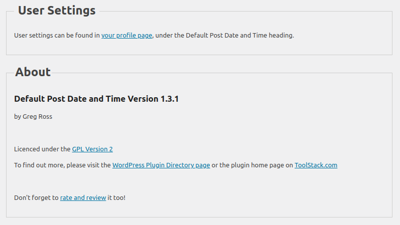
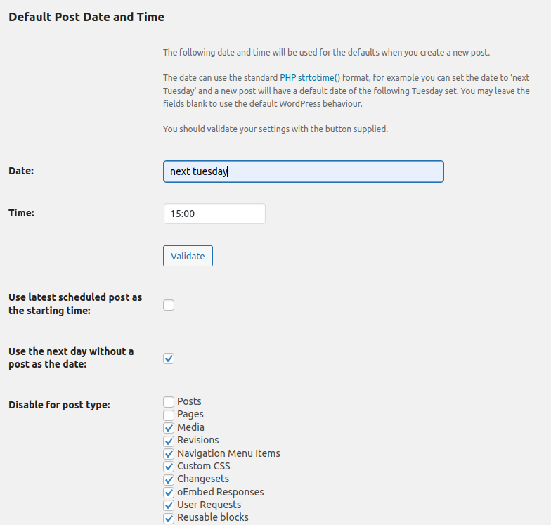

# Default Post Date and Time #
**Contributors:** [gregross](https://profiles.wordpress.org/gregross/)  
**Tags:** admin  
**Requires at least:** 3.8  
**Tested up to:** 6.1.1  
**Author URI:** http://toolstack.com  
**Plugin URI:** http://toolstack.com/default-post-datetime  
**Stable tag:** 1.4  
**License:** GPL2  

Set the default date and time when you create a new post.

## Description ##

When you create a new post in WordPress, the publish date is set to 'immediately', this plugin allows you more control over this behaviour and set a date or time of your choosing.

For example, you can choose to have new posts scheduled for:

* first Tuesday of next month at 5:30pm
* next Monday at 09:00
* Friday at 19:30

Any format that PHP's [strtotime](http://php.net/manual/en/datetime.formats.php) function can understand can be used.

In addition, you can set the default post date/time to be based on:

* The day after your last currently scheduled post
* the next day that doesn't have a scheduled post already

Settings are on a per user basis, just go to your profile page!

This code is released under the GPL v2, see license.txt for details.

## Installation ##

1. Extract the archive file into your plugins directory in the default-post-datetime folder.
2. Activate the plugin in the Plugin options.
3. Customize the settings from the the Your Profile page, if desired.

## Frequently Asked Questions ##

### I'm formatting a date/time that seems to be valid and works but when I hit the validate button it says its wrong? ###

The validate button uses JavaScript to do it's work and JavaScript does not have a strtotime() function and so not all cases may be supported.  If the configuration you have set is working as you expect you can safely ignore the validation errors.

As of version 1.4, the strtotime function as been significantly enhanced as more cases are supported.

### Can I use non-English words in the date/time fields? ###

No, strtotime() does not support internationalization and therefore neither does this plugin.

## Screenshots ##

### 1. A screenshot of the admin settings page. ###

### 2. A screenshot of the user settings page. ###

## Changelog ##
### 1.4 ###
* Release date: TBD
* Added "Use the next day without a post" option.
* Updated strtotime js library.

### 1.3.1 ###
* Release date: October 5, 2015
* Added load_plugin_textdomain() call

### 1.3 ###
* Release date: October 2, 2015
* Added translation. domain.
* Fixed WP_Debug warning on profile screen.

### 1.2 ###
* Release date: May 15, 2015
* Fixed WP_Debug warning on profile screen.
* Fixed user id bug on profile screen.
* Fixed user profile only displays if the user has edit privileges.

### 1.1 ###
* Release date: October 3, 2014
* Fixed PHP warning when no post types had been excluded on new post creation.

### 1.0 ###
* Release date: October 3, 2014
* Added some colour to the validation icons.
* Added support for using the latest scheduled post to calculate the date from.
* Added rate/review and page links to the plugin list.
* Added exclusion for post types.
* Fixed button styling on the profile page.

### 0.1 ###
* Release date: October 2, 2014
* Initial release.

## Upgrade Notice ##

### 1.0 ###
None.

